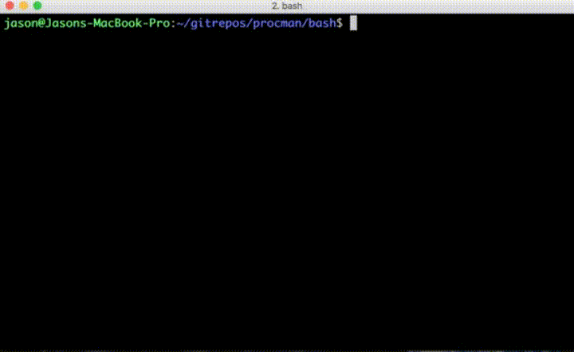

procman
=======

Bash (or PHP) process manager

**- Example Bash script**
```sh
#!/bin/bash
. procman.sh

EXIT_MESSAGE="Sleeping finished."
EXIT_MESSAGE_INCOMPLETE="Sleeping exited."

for SLEEP in 1 5 2 3; do
  sleep $SLEEP &
  addScript "Sleep $SLEEP"
done

runStatusChecker
```



**- Example PHP script**
```php
<?

include("procman.php");

CONST POOL = "sleep";

for ($i = 1; $i <= 5; $i++) {
    $command = "sleep $i";
    if (rand(1,5) == 1) {
        $command .= " && exit 1";
    }
    else if (rand(1,5) == 1) {
        $command .= " && echo 'Some error message' 1>&2";
    }
    ProcessManager::addThread($command, "Sleep $i", POOL);
}

for ($finished = false; !$finished; sleep(1)) {
    $finished = true;
    CLI::cursorBack();
    /** @var $thread ProcessThread */
    foreach (ProcessManager::$processThreads[POOL] as $name => $thread) {
        $thread->update();
        if ($thread->error) {
            CLI::out("$name: Failed - " . $thread->error);
        }
        else if ($thread->exit_code) {
            CLI::out("$name: Failed - Exit code: " . $thread->exit_code);
        }
        else if (!$thread->done) {
            CLI::out("$name: Running");
            $finished = false;
        }
        else {
            CLI::out("$name: Complete");
        }
    }
}

echo "Sleeping finished.\n";
```
```sh
php sleep.php
Sleep 1: Complete
Sleep 2: Failed - Some error message
Sleep 3: Complete
Sleep 4: Complete
Sleep 5: Failed - Exit code: 1
Sleeping finished.
```
